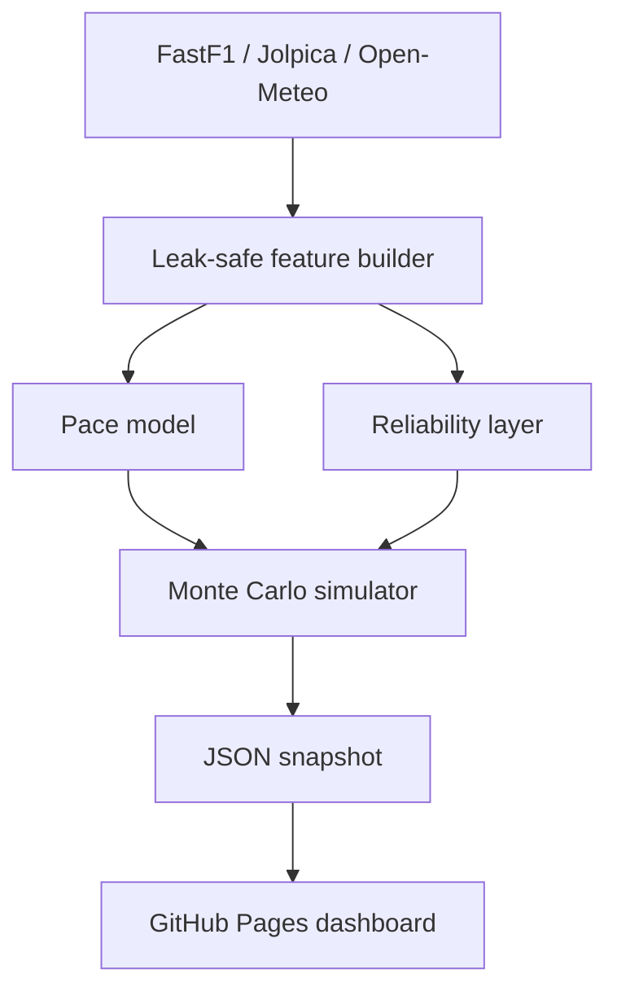

# RaceTwin AI 2026

> Before lights out, quantify the uncertainty.

[](https://apepsis.github.io/RaceTwin-AI-2026/)
[](https://www.python.org/)
[](LICENSE)

RaceTwin AI is an open, uncertainty-aware Formula racing prediction engine for the 2026 regulation era. It converts practice pace, qualifying, weather, reliability and strategy assumptions into calibrated race-outcome probabilities through Monte Carlo simulation.

The repository includes:

- A responsive, interactive GitHub Pages dashboard with no server and no paid API.
- A 10,000-race Monte Carlo simulator in JavaScript and Python.
- A leak-safe gradient-boosted position model.
- Historical training through the free Jolpica-F1 API.
- Optional completed-session telemetry through FastF1.
- Current weather through Open-Meteo.
- Walk-forward backtesting and explicit uncertainty reporting.
- Automated tests and free GitHub Actions workflows.

## Live website

After publication, the URL will be:

**https://apepsis.github.io/RaceTwin-AI-2026/**

The included initial snapshot is clearly labeled as synthetic demonstration data. Run the public-data refresh workflow to replace it with a timestamped open-data snapshot.

## Deploy in under five minutes

1. Download and unzip this project.
2. Create a public GitHub repository named `RaceTwin-AI-2026`.
3. Upload **the contents inside this folder**, not the ZIP itself.
4. Open **Settings → Pages → Source → GitHub Actions**.
5. Open **Actions → Deploy RaceTwin to GitHub Pages → Run workflow**.

Detailed instructions in Spanish: [DEPLOY_GITHUB_ES.md](DEPLOY_GITHUB_ES.md).

## What the model predicts

- Win probability.
- Podium probability.
- Mechanical non-finish probability.
- Evolution from FP1 to qualifying.
- Monte Carlo sampling interval.
- Explanation of the largest forecast drivers.

It does **not** claim that an exact winner is knowable. Random incidents, Safety Cars, penalties and failures make the outcome irreducibly uncertain.

## Architecture



## Quick local run

The dashboard is static. You can open it through any local web server:

```bash
python -m http.server 8000
```

Then visit `http://localhost:8000`.

Install the model package:

```bash
python -m venv .venv
source .venv/bin/activate  # Windows: .venv\Scripts\activate
pip install -e ".[dev]"
pytest -q
```

Generate a reproducible offline snapshot:

```bash
python scripts/update_prediction.py --simulations 10000
```

Attempt a current standings and weather refresh:

```bash
python scripts/update_prediction.py --live --simulations 10000
```

## Train and backtest

```bash
python scripts/train_model.py --start-season 2018 --end-season 2025
```

The training frame is built chronologically. Driver and constructor form are computed only from races that occurred before the target race. This prevents future-information leakage.

The command writes:

- `models/position_model.joblib`
- `data/backtest_metrics.json`

Metrics include top-one accuracy, top-three winner coverage, finishing-position MAE and multiclass Brier score.

## Optional telemetry

Install the optional FastF1 dependency:

```bash
pip install -e ".[telemetry]"
python scripts/extract_weekend_telemetry.py --event "Dutch Grand Prix"
```

The public channels include speed, RPM, gear, throttle and brake. They do not expose direct MGU-K power or battery state of charge. RaceTwin therefore labels its acceleration-based quantity as an **energy deployment proxy**, never as measured electrical deployment.

## Repository structure

```text
.
├── index.html                  # GitHub Pages entry point
├── app.js / styles.css         # Interactive dashboard
├── data/                       # Browser snapshots and backtest output
├── src/racetwin/               # Data, ML and simulation package
├── scripts/                    # Refresh, train and telemetry commands
├── tests/                      # Reproducibility and probability checks
├── docs/                       # Research and data documentation
└── .github/workflows/          # Free automation and deployment
```

## Research question

> Can an uncertainty-aware model with temporal transfer and online weekend updates adapt to the 2026 technical regime and outperform grid-only baselines in calibrated pre-race probabilities?

Recommended experiments:

1. Pre-2026 model versus a 2026-weighted adaptation model.
2. Grid-only baseline versus pace + reliability + weather.
3. Ablations without telemetry, weather or reliability.
4. Calibration before and after each weekend session.
5. Out-of-distribution detection after technical regulation amendments.

## Free data policy

| Source | Use | Cost constraint |
|---|---|---|
| [Jolpica-F1](https://github.com/jolpica/jolpica-f1) | Results and standings | Free community API |
| [FastF1](https://github.com/theOehrly/Fast-F1) | Timing and completed-session telemetry | Open-source client |
| [Open-Meteo](https://open-meteo.com/en/docs) | Current and forecast weather | Free for eligible non-commercial use |
| [FIA regulations](https://www.fia.com/F126) | Regulation versioning | Public documents |

Review each source's current terms before commercial use or high-volume redistribution.

## Scientific honesty

- Prediction timestamps are preserved.
- Demo and public-source snapshots are labeled separately.
- Missing data are not silently imputed as measured telemetry.
- Mechanical failures and racing incidents are not treated as the same event.
- The dashboard leaves validation metrics blank until a real backtest generates them.
- 10,000 simulations reduce Monte Carlo sampling noise; they do not eliminate model error.

See [MODEL_CARD.md](MODEL_CARD.md), [docs/METHODOLOGY.md](docs/METHODOLOGY.md) and [docs/RESEARCH_PROTOCOL.md](docs/RESEARCH_PROTOCOL.md).

## Disclaimer

Independent educational and research project. Not affiliated with Formula 1, Formula One Management, the FIA, any constructor, team or driver. Formula 1-related marks belong to their respective owners. This project is not betting or financial advice.

## License

Code is released under the [MIT License](LICENSE). Data obtained from third parties remains subject to the terms of its original source.
